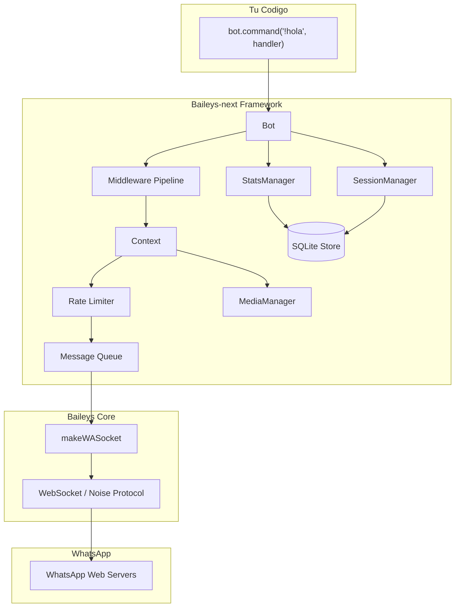
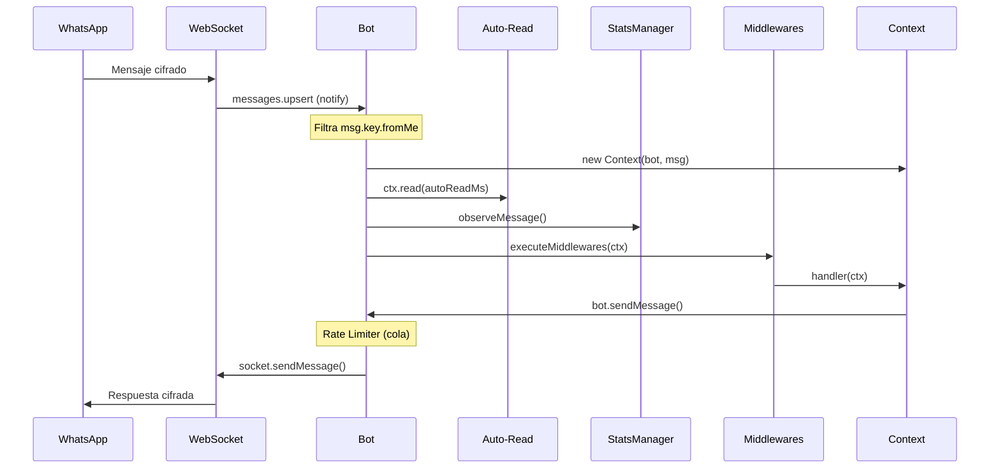
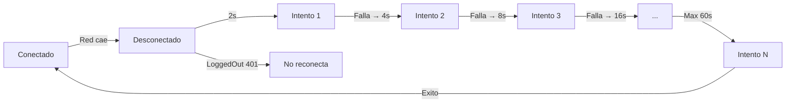
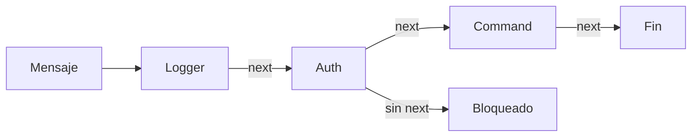
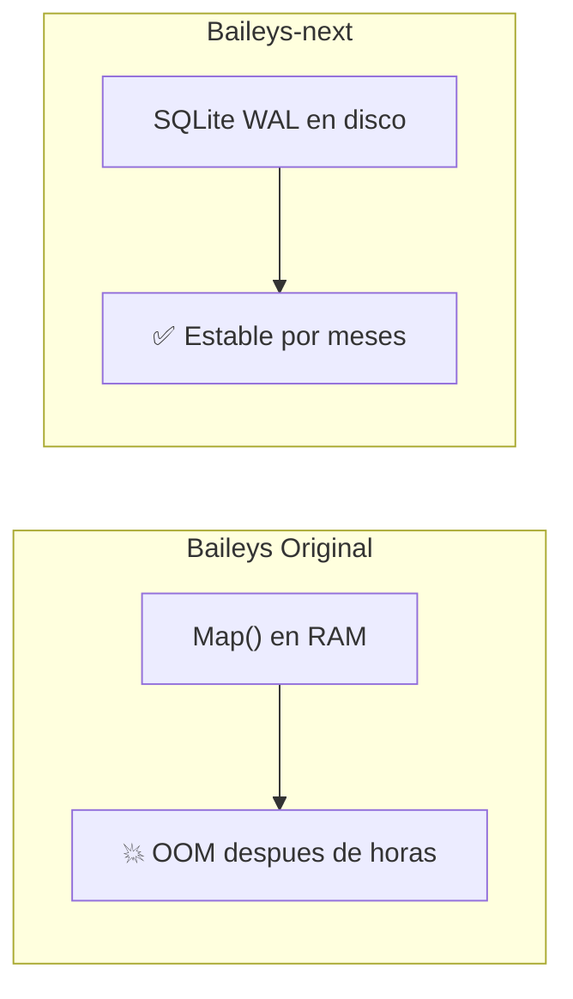
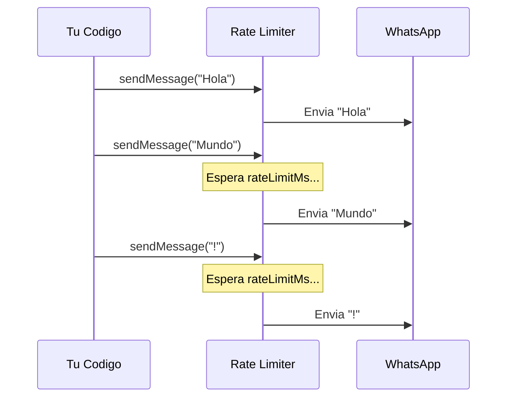

<h1 align="center">
  
  <br/>
  Baileys-next
</h1>

<p align="center">
  <b>La libreria de WhatsApp Web para Node.js, reimaginada para produccion.</b>
  <br/>
  Fork de alto rendimiento de <a href="https://github.com/WhiskeySockets/Baileys">WhiskeySockets/Baileys</a> con persistencia SQLite, Rate Limiter, Multimedia automatica y Analiticas de grupo.
</p>

<p align="center">
  <a href="#-instalacion"></a>
  <a href="https://github.com/LuferOS/Baileys-next/blob/master/LICENSE"></a>
  <a href="https://github.com/LuferOS/Baileys-next"></a>
</p>

---

## Tabla de Contenidos

- [Por que Baileys-next](#-por-que-baileys-next)
- [Antes vs Ahora (Comparaciones)](#-antes-vs-ahora)
- [Arquitectura](#-arquitectura)
- [Instalacion](#-instalacion)
- [Guia Rapida](#-guia-rapida)
- [Referencia de la API](#-referencia-de-la-api)
  - [BotConfig](#botconfig)
  - [Clase Bot](#clase-bot)
  - [Clase Context](#clase-context-ctx)
  - [StatsManager](#statsmanager)
  - [SessionManager](#sessionmanager)
  - [MediaManager](#mediamanager)
- [Middlewares](#-middlewares)
- [Persistencia SQLite](#-persistencia-sqlite)
- [Rate Limiter y Anti-Ban](#-rate-limiter-y-anti-ban)
- [Analiticas y Fantasmas](#-analiticas-y-fantasmas)
- [Multimedia (Stickers y Notas de Voz)](#-multimedia-stickers-y-notas-de-voz)
- [Sesiones Persistentes](#-sesiones-persistentes)
- [Acceso a Bajo Nivel](#-acceso-a-bajo-nivel)
- [Evitar Problemas Comunes](#-evitar-problemas-comunes)
- [Migracion desde Baileys Original](#-migracion-desde-baileys-original)
- [Contribuir](#-contribuir)
- [Creditos y Reconocimientos](#-creditos-y-reconocimientos)
- [Aviso Legal](#-aviso-legal)

---

## 🚀 Por que Baileys-next

La libreria original de Baileys es un motor brillante, pero fue disenada como una capa de bajo nivel. Cuando miles de desarrolladores la usaron para construir bots de produccion, aparecieron problemas repetidos:

| Problema | Baileys Original | Baileys-next |
|---|---|---|
| Consumo de RAM | Crece sin limite (in-memory store) | Constante (~15 MB) gracias a SQLite en disco |
| Desconexiones | El desarrollador debe manejar la reconexion | Exponential Backoff automatico integrado |
| Envio masivo | Sin proteccion, alto riesgo de ban | Rate Limiter con cola inteligente |
| Multimedia | Requiere FFmpeg manual en el sistema | `ffmpeg-static` incluido, 0 instalacion extra |
| Analiticas de grupo | No existe | StatsManager con deteccion de "fantasmas" |
| Experiencia de desarrollo | Callbacks y eventos crudos | API de alto nivel con `Bot`, `Context` y Middlewares |
| Logging | No estandarizado | Logger pino-compatible (structured JSON) |
| Credenciales | Se pierden si registras listener en mal momento | `bot.onCreds()` garantiza el registro correcto |
| Mensajes propios | El bot se responde a si mismo si no filtras | Filtrado automatico de `msg.key.fromMe` |

---

## 🔄 Antes vs Ahora

### Responder a un Mensaje

**Antes (Baileys original) — 15 lineas:**
```typescript
import makeWASocket, { useMultiFileAuthState, DisconnectReason } from '@whiskeysockets/baileys'
import { Boom } from '@hapi/boom'

async function start() {
    const { state, saveCreds } = await useMultiFileAuthState('auth')
    const sock = makeWASocket({ auth: state, printQRInTerminal: true })

    sock.ev.on('creds.update', saveCreds)
    sock.ev.on('connection.update', ({ connection, lastDisconnect }) => {
        if (connection === 'close') {
            const shouldReconnect = (lastDisconnect?.error as Boom)?.output?.statusCode !== DisconnectReason.loggedOut
            if (shouldReconnect) start()
        }
    })
    sock.ev.on('messages.upsert', async ({ messages, type }) => {
        if (type !== 'notify') return
        for (const msg of messages) {
            if (msg.key.fromMe) continue
            if (msg.message?.conversation === '!ping') {
                await sock.sendMessage(msg.key.remoteJid!, { text: 'Pong!' }, { quoted: msg })
            }
        }
    })
}
start()
```

**Ahora (Baileys-next) — 8 lineas:**
```typescript
import { Bot, useMultiFileAuthState } from 'baileys-next'

async function start() {
    const { state, saveCreds } = await useMultiFileAuthState('auth')
    const bot = new Bot({ auth: state, printQRInTerminal: true })

    bot.onCreds(saveCreds) // Seguro antes de start()
    bot.command('!ping', async (ctx) => ctx.reply({ text: 'Pong!' }))
    await bot.start() // Reconexion automatica incluida
}
start()
```

---

### Reconexion tras Caida

**Antes — Debes gestionar manualmente:**
```typescript
sock.ev.on('connection.update', ({ connection, lastDisconnect }) => {
    if (connection === 'close') {
        const error = lastDisconnect?.error as Boom
        const statusCode = error?.output?.statusCode
        if (statusCode !== DisconnectReason.loggedOut) {
            // Reconectar... pero sin retardo. Si WhatsApp te bloquea
            // temporalmente, este loop infinito empeora todo.
            start()
        }
    }
})
```

**Ahora — Automatico con Exponential Backoff:**
```typescript
const bot = new Bot({ auth: state })
await bot.start()
// Listo. Si se cae la conexion:
// Intento 1: espera 2s
// Intento 2: espera 4s
// Intento 3: espera 8s
// ... hasta maximo 60s
// Si es LoggedOut (sesion cerrada), NO reconecta.
```

---

### Crear un Sticker

**Antes — Instalar FFmpeg manualmente + 20 lineas de conversion:**
```typescript
// Requisito: apt install ffmpeg (o brew install ffmpeg)
import { exec } from 'child_process'
import fs from 'fs'

// Descargar el media...
const buffer = await downloadMediaMessage(msg, 'buffer', {})
fs.writeFileSync('/tmp/input.jpg', buffer)

// Convertir a WebP con shell
exec('ffmpeg -i /tmp/input.jpg -vcodec libwebp -vf scale=512:512 /tmp/output.webp', async () => {
    const sticker = fs.readFileSync('/tmp/output.webp')
    await sock.sendMessage(jid, { sticker }, { quoted: msg })
    // Y los metadatos EXIF? Otro paquete mas...
})
```

**Ahora — 1 linea (FFmpeg incluido):**
```typescript
bot.command('!sticker', async (ctx) => {
    await ctx.replySticker(imageBuffer, { packname: 'MiBot', author: '@luis' })
    // FFmpeg + conversion + metadatos EXIF = todo incluido
})
```

---

### Guardar Estado por Chat

**Antes — Variable en memoria (se pierde al reiniciar):**
```typescript
const estados = new Map<string, any>() // Se pierde al reiniciar

sock.ev.on('messages.upsert', async ({ messages }) => {
    for (const msg of messages) {
        const jid = msg.key.remoteJid!
        if (msg.message?.conversation === '!recordar') {
            estados.set(jid, { nota: 'algo' })
        }
        if (msg.message?.conversation === '!nota') {
            const data = estados.get(jid)
            // Despues del reinicio: undefined
        }
    }
})
```

**Ahora — Persistente en SQLite (sobrevive reinicios):**
```typescript
bot.command('!recordar', async (ctx) => {
    ctx.session.set({ nota: 'algo' }) // Guardado en disco
})

bot.command('!nota', async (ctx) => {
    const data = ctx.session.get<{ nota: string }>()
    await ctx.reply({ text: data?.nota ?? 'Sin notas' })
    // Despues del reinicio: la nota sigue ahi
})
```

---

### Detectar Fantasmas de un Grupo

**Antes — No existia:**
```typescript
// No habia forma de saber quien nunca habla.
// Tenias que construir tu propia base de datos,
// registrar cada mensaje manualmente, comparar
// con la lista de participantes...
// Facilmente +100 lineas de codigo.
```

**Ahora — 3 lineas:**
```typescript
bot.command('!fantasmas', async (ctx) => {
    const ghosts = await bot.stats.getGhosts(ctx.remoteJid, 30)
    await ctx.reply({ text: `👻 ${ghosts.length} fantasmas encontrados` })
})
```

---

### Enviar Multiples Mensajes sin ser Baneado

**Antes — Sin proteccion:**
```typescript
// Enviar 50 mensajes en un loop = ban instantaneo
for (const jid of contactos) {
    await sock.sendMessage(jid, { text: 'Hola!' })
    // WhatsApp detecta envios a 0ms de intervalo
}
```

**Ahora — Rate Limiter automatico:**
```typescript
const bot = new Bot({ auth: state, rateLimitMs: 2000 })

// Mismo loop, pero internamente la libreria espera 2s entre cada envio
for (const jid of contactos) {
    await bot.sendMessage(jid, { text: 'Hola!' })
    // La cola interna los despacha a 2000ms de intervalo
}
```

---

### Registrar Credenciales

**Antes — Bug silencioso si lo haces antes de conectar:**
```typescript
const sock = makeWASocket({ auth: state })

// BUG: Si haces esto antes de que el socket conecte, funciona
// PERO si alguien hace bot.socket?.ev.on(...) antes de start(),
// como socket es undefined, el listener nunca se registra!
sock.ev.on('creds.update', saveCreds)
```

**Ahora — Garantizado:**
```typescript
const bot = new Bot({ auth: state })
bot.onCreds(saveCreds) // Seguro. Se registra internamente y se ejecuta siempre.
await bot.start()
```

---

## 🏗 Arquitectura



**Flujo de un mensaje entrante:**



**Flujo de reconexion:**



---

## 📦 Instalacion

### Desde GitHub (recomendado)
```bash
npm install github:LuferOS/Baileys-next
```

### Desde NPM (proximamente)
```bash
npm install baileys-next
```

### Requisitos
- **Node.js** >= 20 (recomendado: v20 LTS o v22 LTS)
- **Sistema operativo**: Windows, macOS, Linux
- **No se necesita** instalar FFmpeg manualmente (incluido via `ffmpeg-static`)

> **Nota sobre Node.js v24+:** La version bleeding-edge de Node puede causar fallos al compilar `better-sqlite3`. Si tienes problemas, usa Node 22 LTS con `nvm use 22`.

---

## ⚡ Guia Rapida

### Ejemplo Minimo

```typescript
import { Bot, useMultiFileAuthState } from 'baileys-next'

async function main() {
    const { state, saveCreds } = await useMultiFileAuthState('auth_session')

    const bot = new Bot({
        auth: state,
        printQRInTerminal: true
    })

    bot.onCreds(saveCreds)
    bot.command('!ping', async (ctx) => {
        await ctx.reply({ text: 'Pong! 🏓' })
    })

    await bot.start()
}

main()
```

### Ejemplo Completo (Produccion)

```typescript
import { Bot, useMultiFileAuthState } from 'baileys-next'

async function main() {
    const { state, saveCreds } = await useMultiFileAuthState('auth_session')

    const bot = new Bot({
        auth: state,
        printQRInTerminal: true,
        rateLimitMs: 1500,   // Escudo Anti-Ban
        autoReadMs: 2000,    // Lectura humana
        enableStats: true,   // Analiticas
        dbPath: './data/bot.db' // Ruta de la base de datos
    })

    bot.onCreds(saveCreds)

    // --- Middleware global: Logger ---
    bot.use(async (ctx, next) => {
        console.log(`[${new Date().toISOString()}] ${ctx.sender} -> ${ctx.remoteJid}`)
        await next()
    })

    // --- Comandos ---
    bot.command('!ping', async (ctx) => {
        const start = Date.now()
        await ctx.reply({ text: `Pong! 🏓 (${Date.now() - start}ms)` })
    })

    bot.command('!fantasmas', async (ctx) => {
        if (!ctx.isGroup || !bot.stats) return
        const ghosts = await bot.stats.getGhosts(ctx.remoteJid, 30)
        const total = ghosts.filter(g => g.isTotalGhost).length
        const inactive = ghosts.filter(g => !g.isTotalGhost).length
        await ctx.reply({
            text: `👻 Fantasmas del grupo:\n` +
                  `- Nunca han hablado: ${total}\n` +
                  `- Inactivos (30 dias): ${inactive}\n` +
                  `- Total: ${ghosts.length}`
        })
    })

    bot.command('!top', async (ctx) => {
        if (!ctx.isGroup || !bot.stats) return
        const top = bot.stats.getTopUsers(ctx.remoteJid, 5)
        const lines = top.map((u, i) =>
            `${i + 1}. @${u.userJid.split('@')[0]} — ${u.messageCount} msgs`
        )
        await ctx.reply({
            text: `🏆 Top 5:\n${lines.join('\n')}`,
            mentions: top.map(u => u.userJid)
        })
    })

    bot.command('!react', async (ctx) => {
        await ctx.react('❤️')
    })

    bot.command('!recordar', async (ctx) => {
        const args = ctx.text?.replace('!recordar ', '') || ''
        ctx.session.set({ nota: args })
        await ctx.reply({ text: `📝 Guardado: "${args}"` })
    })

    bot.command('!nota', async (ctx) => {
        const data = ctx.session.get<{ nota: string }>()
        await ctx.reply({ text: data?.nota ? `📝 "${data.nota}"` : 'Sin notas.' })
    })

    // Cleanup al cerrar
    process.on('SIGINT', () => {
        bot.close()
        process.exit(0)
    })

    await bot.start()
}

main()
```

---

## 📖 Referencia de la API

### BotConfig

Extiende `UserFacingSocketConfig` de Baileys (todas las opciones originales siguen funcionando).

| Opcion | Tipo | Default | Descripcion |
|---|---|---|---|
| `auth` | `AuthenticationState` | **requerido** | Estado de autenticacion (de `useMultiFileAuthState`) |
| `printQRInTerminal` | `boolean` | `false` | Muestra el codigo QR en la terminal |
| `enableStats` | `boolean` | `true` | Activa el `StatsManager` para analiticas de grupo |
| `rateLimitMs` | `number` | `undefined` | Milisegundos entre cada mensaje enviado. `undefined` = sin limite |
| `autoReadMs` | `number` | `undefined` | Retardo antes de marcar como leido. `undefined` = no auto-lee |
| `dbPath` | `string` | `'baileys_store.db'` | Ruta del archivo SQLite |
| `browser` | `[string, string, string]` | `['Mac OS', 'Chrome', '...']` | Identidad del navegador |
| `logger` | `ILogger` | `console` | Logger pino-compatible para depuracion |

---

### Clase Bot

La clase principal. Orquesta socket, middlewares, base de datos y todas las funciones.

```typescript
const bot = new Bot(config: BotConfig)
```

| Metodo / Propiedad | Retorno | Descripcion |
|---|---|---|
| `bot.start()` | `Promise<void>` | Conecta a WhatsApp y empieza a escuchar |
| `bot.close()` | `void` | Shutdown graceful: cierra DB, vacia colas |
| `bot.command(cmd, handler)` | `void` | Registra handler para mensajes que empiecen con `cmd` |
| `bot.onText(handler)` | `void` | Registra handler para todos los mensajes de texto |
| `bot.use(middleware)` | `void` | Registra un middleware (ver seccion Middlewares) |
| `bot.onCreds(handler)` | `void` | Registra handler para guardar credenciales (seguro antes de start) |
| `bot.onConnection(handler)` | `void` | Registra handler para cambios de conexion (seguro antes de start) |
| `bot.sendMessage(jid, content, opts?)` | `Promise<unknown>` | Envia mensaje (pasa por Rate Limiter si activo) |
| `bot.socket` | `WASocket \| undefined` | Acceso directo al socket de Baileys (bajo nivel) |
| `bot.store` | `SQLiteStore` | Instancia de la base de datos SQLite |
| `bot.stats` | `StatsManager \| undefined` | Gestor de analiticas (si `enableStats` es true) |
| `bot.session` | `SessionManager` | Gestor de sesiones persistentes por chat |
| `bot.isConnected` | `boolean` | Estado actual de la conexion |

---

### Clase Context (`ctx`)

Envuelve cada mensaje entrante con metodos convenientes. Se pasa como primer argumento a handlers y middlewares.

| Metodo / Propiedad | Retorno | Descripcion |
|---|---|---|
| `ctx.message` | `WAMessage` | Mensaje crudo original de WhatsApp |
| `ctx.remoteJid` | `string` | JID del chat (grupo o privado) |
| `ctx.sender` | `string` | JID del remitente (funciona en grupos y privados) |
| `ctx.isGroup` | `boolean` | `true` si es un grupo (`@g.us`) |
| `ctx.text` | `string \| undefined` | Texto del mensaje |
| `ctx.bot` | `Bot` | Referencia al Bot padre |
| `ctx.reply(content, opts?)` | `Promise<unknown>` | Responde al mensaje (con quote automatico) |
| `ctx.send(content, opts?)` | `Promise<unknown>` | Envia al mismo chat sin citar |
| `ctx.react(emoji)` | `Promise<unknown>` | Reacciona con un emoji |
| `ctx.replySticker(buffer, meta?)` | `Promise<unknown>` | Envia sticker WebP (convierte automaticamente) |
| `ctx.replyVoiceNote(buffer)` | `Promise<unknown>` | Envia nota de voz Opus/OGG |
| `ctx.read(delayMs?)` | `Promise<unknown>` | Marca como leido con retardo opcional |
| `ctx.session.get<T>()` | `T \| undefined` | Obtiene datos de sesion del chat |
| `ctx.session.set(data)` | `void` | Guarda datos de sesion |
| `ctx.session.update(data)` | `void` | Merge parcial de datos |
| `ctx.session.delete()` | `void` | Elimina la sesion |

---

### StatsManager

Motor de analiticas silencioso. Almacena estadisticas en SQLite, indexadas por grupo.

| Metodo | Retorno | Descripcion |
|---|---|---|
| `stats.getTopUsers(groupJid, limit?)` | `UserStats[]` | Los `limit` usuarios mas activos |
| `stats.getTopStickers(groupJid, limit?)` | `UserStats[]` | Los que mas stickers envian |
| `stats.getGhosts(groupJid, days?)` | `Promise<GhostEntry[]>` | Miembros inactivos en `days` dias |
| `stats.getUserStats(groupJid, userJid)` | `UserStats \| undefined` | Stats de un usuario especifico |
| `stats.observeMessage(groupJid, userJid, isSticker)` | `void` | Registra mensaje (automatico) |

**Interfaces:**
```typescript
interface UserStats {
    userJid: string
    messageCount: number
    stickerCount: number
    lastActive: number // timestamp
}

interface GhostEntry {
    jid: string
    isTotalGhost: boolean  // true = nunca ha enviado un mensaje
    lastActive?: number    // timestamp del ultimo mensaje
}
```

---

### SessionManager

Estado persistente por chat. Util para flujos multi-paso, estados de conversacion, encuestas, etc.

| Metodo | Retorno | Descripcion |
|---|---|---|
| `session.get<T>(jid)` | `T \| undefined` | Obtiene datos |
| `session.set(jid, data)` | `void` | Guarda (reemplaza todo) |
| `session.update(jid, data)` | `void` | Merge parcial |
| `session.delete(jid)` | `void` | Elimina |
| `session.has(jid)` | `boolean` | Verifica existencia |

---

### MediaManager

Utilidad estatica para conversion multimedia. No requiere instanciacion.

| Metodo | Retorno | Descripcion |
|---|---|---|
| `MediaManager.convertToSticker(input, meta?)` | `Promise<Buffer>` | Imagen/video a WebP (512x512) con EXIF |
| `MediaManager.convertToVoiceNote(input)` | `Promise<Buffer>` | Audio a Opus/OGG mono 48kHz |

---

## 🔗 Middlewares

Pipeline inspirado en Koa/Express. Cada middleware recibe `ctx` y `next()`.



### Ejemplo: Logger + Filtro de Admin

```typescript
// Logger global
bot.use(async (ctx, next) => {
    const start = Date.now()
    await next()
    console.log(`[${Date.now() - start}ms] ${ctx.sender}: ${ctx.text}`)
})

// Filtro de admin (no llama next() si no es admin)
bot.use(async (ctx, next) => {
    if (ctx.text?.startsWith('!admin')) {
        const admins = ['5491100000000@s.whatsapp.net']
        if (!admins.includes(ctx.sender)) {
            await ctx.reply({ text: '⛔ Sin permisos.' })
            return
        }
    }
    await next()
})

// Solo admins llegan aqui
bot.command('!admin kick', async (ctx) => { /* ... */ })
```

> **Regla de oro:** Si no llamas a `await next()`, la cadena se detiene.

---

## 💾 Persistencia SQLite



### Tablas creadas automaticamente

| Tabla | Uso |
|---|---|
| `kv_store` | Contador de reintentos + sesiones (`msgRetryCounterCache`) |
| `group_stats` | Contadores de mensajes, stickers, timestamps (indexado por `group_jid`) |

### Configuracion

```typescript
const bot = new Bot({
    auth: state,
    dbPath: './data/mi_bot.db' // Default: 'baileys_store.db'
})
```

La DB usa `journal_mode = WAL` (Write-Ahead Logging) para lecturas concurrentes sin bloqueo.

---

## 🛡 Rate Limiter y Anti-Ban



### Configuracion recomendada

| Escenario | `rateLimitMs` | `autoReadMs` |
|---|---|---|
| Bot personal | `500` | `1000` |
| Bot de grupo (< 50) | `1500` | `2000` |
| Bot de servicio (100+) | `2000 - 3000` | `2000 - 3000` |

### Auto-Read manual
```typescript
bot.command('!test', async (ctx) => {
    await ctx.read(1500) // Clava el visto con 1.5s de retardo
    await ctx.reply({ text: 'Listo!' })
})
```

---

## 👻 Analiticas y Fantasmas

```typescript
// Fantasmas (inactivos 30+ dias)
const ghosts = await bot.stats.getGhosts(ctx.remoteJid, 30)

// Top 10 activos
const top = bot.stats.getTopUsers(ctx.remoteJid, 10)

// Top stickereros
const stickers = bot.stats.getTopStickers(ctx.remoteJid, 5)

// Stats de un usuario especifico
const user = bot.stats.getUserStats(ctx.remoteJid, '5491100000000@s.whatsapp.net')
```

---

## 🎨 Multimedia (Stickers y Notas de Voz)

```typescript
// Sticker con metadatos
await ctx.replySticker(imageBuffer, { packname: 'MiBot', author: '@luis' })

// Nota de voz nativa
await ctx.replyVoiceNote(audioBuffer)

// Tambien acepta rutas de archivo
await ctx.replySticker('/tmp/imagen.png')
await ctx.replyVoiceNote('/tmp/audio.mp3')
```

**Especificaciones tecnicas:**
- Stickers: WebP, 512x512, con transparencia, metadatos EXIF inyectados
- Notas de voz: Opus/OGG, mono, 48kHz (formato nativo PTT de WhatsApp)
- FFmpeg incluido via `ffmpeg-static` (0 instalacion manual)

---

## 📋 Sesiones Persistentes

Flujos multi-paso que sobreviven reinicios:

```typescript
// Flujo de encuesta con estados
bot.command('!encuesta', async (ctx) => {
    ctx.session.set({ paso: 1, pregunta: '¿Color favorito?' })
    await ctx.reply({ text: '¿Cual es tu color favorito?' })
})

bot.onText(async (ctx, next) => {
    const state = ctx.session.get<{ paso: number, pregunta: string }>()
    if (state?.paso === 1) {
        ctx.session.update({ paso: 2, respuesta: ctx.text })
        await ctx.reply({ text: `Guardado: ${ctx.text}. ¿Tu comida favorita?` })
        return // No propagar
    }
    if (state?.paso === 2) {
        ctx.session.delete() // Limpiar
        await ctx.reply({ text: `Encuesta completa!` })
        return
    }
    await next()
})
```

---

## 🔧 Acceso a Bajo Nivel

`bot.socket` expone el socket original de Baileys:

```typescript
await bot.socket?.sendPresenceUpdate('composing', jid)
await bot.socket?.profilePictureUrl(jid)
await bot.socket?.groupMetadata(groupJid)
await bot.socket?.updateProfilePicture(jid, buffer)

bot.socket?.ev.on('group-participants.update', handler)
bot.socket?.ev.on('presence.update', handler)
```

---

## ⚠️ Evitar Problemas Comunes

| Problema | Causa | Solucion |
|---|---|---|
| `better-sqlite3` no compila | Node.js v24+ rompe compilacion C++ | Usar Node 22 LTS: `nvm use 22` |
| `ECONNRESET` frecuente | Red inestable | No hacer nada (Exponential Backoff integrado) |
| `LoggedOut` (401) | Sesion cerrada por WA | Eliminar carpeta auth y re-escanear QR |
| Stickers no visibles en iOS | WebP > 100 KB | Recortar video antes de convertir |
| Mensajes fuera de orden | Sin Rate Limiter | Activar `rateLimitMs` |
| Bot se responde a si mismo | Version vieja del fork | Actualizar (filtro `fromMe` incluido) |
| Credenciales no se guardan | `onCreds` despues de `start()` | Usar `bot.onCreds()` antes de `start()` |

---

## 🔄 Migracion desde Baileys Original

### Paso 1: Cambiar dependencia
```bash
npm uninstall @whiskeysockets/baileys
npm install github:LuferOS/Baileys-next
```

### Paso 2: Actualizar imports
```diff
- import makeWASocket from '@whiskeysockets/baileys'
+ import { Bot, useMultiFileAuthState } from 'baileys-next'
```

### Paso 3: Reemplazar patron de socket
```diff
- const sock = makeWASocket({ auth: state })
- sock.ev.on('messages.upsert', ({ messages }) => { ... })
+ const bot = new Bot({ auth: state })
+ bot.command('!cmd', async (ctx) => { ... })
+ await bot.start()
```

### Paso 4: Eliminar makeInMemoryStore
```diff
- import { makeInMemoryStore } from '@whiskeysockets/baileys'
- const store = makeInMemoryStore({})
- store.bind(sock.ev)
// Ya no es necesario. SQLiteStore se inicializa automaticamente.
```

> **Compatibilidad:** `bot.socket` sigue exponiendo todas las funciones originales de Baileys.

---

## 🤝 Contribuir

### Setup
```bash
git clone https://github.com/LuferOS/Baileys-next.git
cd Baileys-next
corepack enable
yarn install
```

### Estructura del Proyecto
```
src/
├── Framework/           ← Codigo del fork (alto nivel)
│   ├── Bot.ts           ← Clase principal, middlewares, rate limiter, reconexion
│   ├── Context.ts       ← Wrapper de mensaje con helpers (reply, react, sticker...)
│   ├── MediaManager.ts  ← Conversion de stickers y notas de voz (ffmpeg-static)
│   ├── SessionManager.ts← Sesiones persistentes por chat
│   ├── StatsManager.ts  ← Analiticas y deteccion de fantasmas
│   ├── Store/
│   │   └── SQLiteStore.ts ← Motor de persistencia SQLite (WAL mode)
│   └── index.ts         ← Re-exports del framework
├── Socket/              ← Core de Baileys (WebSocket, Noise Protocol)
├── Signal/              ← Protocolo Signal (criptografia E2E)
├── Utils/               ← Utilidades del core
├── Types/               ← Tipos TypeScript publicos
├── WABinary/            ← Codificacion binaria de stanzas
└── index.ts             ← Export principal
```

### Validacion
```bash
yarn lint      # TypeScript + ESLint (0 errores)
yarn test      # Tests unitarios
yarn build     # Compilacion limpia
```

### Commits
```bash
git commit -m "feat(framework): add cooldown per user"
git commit -m "fix(media): handle webp conversion on linux"
```

### Que NO contribuir
- Herramientas de spam o mensajeria masiva
- Scrapers de datos sin consentimiento
- Mecanismos para evadir bans legitimos

---

## 💖 Creditos y Reconocimientos

Este proyecto es un **Fork** construido sobre el trabajo excepcional de la comunidad original:

| Contribuidor | Rol |
|---|---|
| **WhiskeySockets / Rajeh** | Creadores y mantenedores actuales del core |
| **@pokearaujo** | Observaciones sobre WhatsApp Multi-Device |
| **@Sigalor** | Ingenieria inversa del protocolo de WA Web |
| **@Rhymen** | Primera implementacion en Go |

Apoya al mantenedor original: [Sponsor Page](https://purpshell.dev/sponsor)

---

## ⚖️ Aviso Legal

*Este proyecto NO esta afiliado, asociado, autorizado, respaldado por, ni conectado de ninguna manera oficial con WhatsApp o cualquiera de sus filiales.*

*Los mantenedores no aprueban el uso en practicas que violen los Terminos de Servicio de WhatsApp (spam, mensajeria masiva no deseada, extraccion de datos sin consentimiento).*

---

<p align="center">
  <sub>Hecho con ❤️ por <a href="https://github.com/LuferOS">LuferOS</a> — Powered by <a href="https://github.com/WhiskeySockets/Baileys">Baileys</a></sub>
</p>
